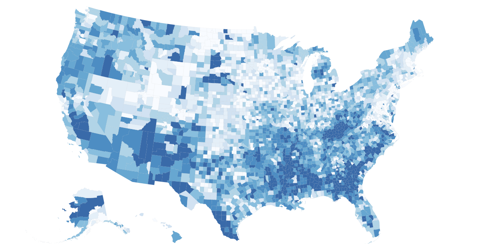
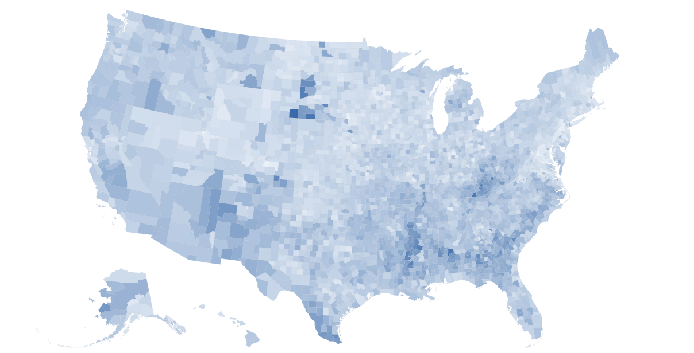
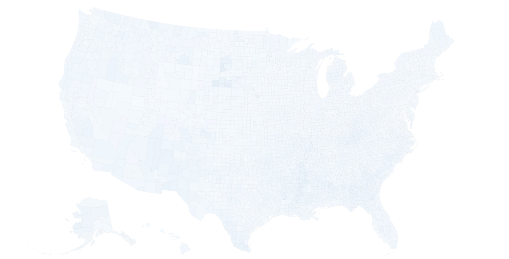

# Introduction to D3: Map Visualization
by [Woojin Kim](http://woojink.com)

This tutorial was created for the [Introduction to D3](https://www.facebook.com/events/1801441506770835/) event hosted by the [Columbia Data Science Society](http://cdssatcu.com/).

## Table of Contents
<!-- MarkdownTOC depth=3 autolink="true" bracket="round" -->

- [Introduction](#introduction)
    - [Why D3.js?](#why-d3js)
    - [Console is your best friend](#console-is-your-best-friend)
- [Data sources](#data-sources)
- [Let's get coding!](#lets-get-coding)
    - [D3.js library](#d3js-library)
    - [Data loading / pre-processing](#data-loading--pre-processing)
    - [SVG setup](#svg-setup)
    - [Geography setup](#geography-setup)
    - [Color scale setup](#color-scale-setup)
    - [The map](#the-map)
    - [Extras: Aesthetics](#extras-aesthetics)
    - [Extras: Mouseover action / tooltip window](#extras-mouseover-action--tooltip-window)
- [Conclusion](#conclusion)
- [Other Resources](#other-resources)

<!-- /MarkdownTOC -->

## Introduction
### Why D3.js?
The main advantages of [D3.js](https://d3js.org/) are that it's extremely flexible and ready for web:

* Almost every aspect of D3 visualizations can be manipulated, from simple aspects like colours to more specific tasks like pixel-perfect positioning, path bezier curving. You have control over each data point as it comes in and can set the logic on how it is interpreted into a visual element. While this may seem daunting, especially from something like Excel or even ggplot2, it is also incredibly rewarding when you're able create exactly the visualization you envision

* It is a JavaScript library that integrates seemlessly into webpages. In comparison to many other data visualization tools that either create static images, require Flash applets, or something like Shiny to deploy R work; D3 just requires a simple script import on a <abbr title="HyperText Markup Language">HTML</abbr> file and all the tools are ready to be integrated into your website.

* It uses [scalable vector graphics](https://en.wikipedia.org/wiki/Scalable_Vector_Graphics) (<abbr title="Scalable Vector Graphics">SVG</abbr>) to create the visualizations, which result in smooth graphics that scale well for different media.s

### Console is your best friend
Your browser's console is an interactive shell for JavaScript, much like running `python` on your terminal. On Firefox, you can bring it up using Cmd/Ctrl (⌘) + Alt (⌥) + K; on Chrome, you can get it using Cmd/Ctrl (⌘) + Alt (⌥) + J.

Here you can test snippets of code, see the raw outputs of your code, explore your variables, and much more. Whenever you have anything you want to see on the console, put the variable in `console.log()`.

## Data sources
* [United States County-level GeoJSON (5m)](http://eric.clst.org/Stuff/USGeoJSON)
* [USDA Economic Research Service - Poverty Data (2014)](https://www.ers.usda.gov/data-products/county-level-data-sets/download-data.aspx)<br />(Make sure you delete the top two rows and save as CSV for this tutorial)

## Let's get coding!
Start with the `template.html` file. It has the basic template for a <abbr title="HyperText Markup Language">HTML</abbr> page already written, as well as basic <abbr title="Cascading Style Sheets">CSS</abbr> definitions for the page and the tooltip we'll add.

### D3.js library
We begin by importing the D3 library. You can either download the script and have it pointing locally or use a <abbr title="Content delivery network">CDN</abbr>. Go ahead import the <abbr title="Content delivery network">CDN</abbr> version by adding the following snippet somewhere in the header section:
```html
<script src="https://cdnjs.cloudflare.com/ajax/libs/d3/4.3.0/d3.min.js">
</script>
```

### Data loading / pre-processing
Before we get to any visualization, we start by loading the data. We'll be making use of D3's [`queue()`](https://github.com/d3/d3-queue) library to load two datasets then have it callback the visualization code when the data is finished loading. The datasets will be sent to [`d3.json()`](https://github.com/d3/d3-request#json) and [`d3.csv()`](https://github.com/d3/d3-request#csv), according to their file type. The following code block goes in between the `<script>` tags:
```javascript
d3.queue()
    .defer(d3.json, "data/gz_2010_us_050_00_5m.json")
    .defer(d3.csv, "data/PovertyEstimates.csv")
    .await(function(error, map_json, data_csv) {
        // Visualization code to come
    });
```

Try putting `console.log(data_csv)` in the `.await()` block to see how the data looks in the browser. You'll notice that it's a bunch of objects corresponding to data from each county. Also take a look at the map data using `console.log(map_json)`, you'll notice that all the data is nested under the `features` key. Inside each object, you'll see the shape of each county saved under `geometry` and basic facts saved under `properties`.

The ID we're interested in using is the [<abbr title="Federal Information Processing Standards">FIPS</abbr> county code](https://en.wikipedia.org/wiki/FIPS_county_code), which is a combination of state and county codes you see under map data's `properties`. As it'll be more clear later, we want to be able to access the poverty dataset's rows only using the <abbr title="Federal Information Processing Standards">FIPS</abbr> code. To do this, we make use of [`d3.map()`](https://github.com/d3/d3-collection/blob/master/README.md#maps), which is basically a key/value map, much like a dictionary.

We want to create this map as we're loading the data. In D3, most of the time data is involved, you can invoke an anonymous function to process individual rows.
```javascript
function(d) {
    // d corresponds to the row
    // d.FIPStxt or d['FIPStxt'] both returns the FIPS code for that row
}
```

We start by creating a map to be populated before the data loads. Then, we add an anonymous function on the `d3.csv()` loading. First we note that `d3.csv()` loads everything as strings. We need to store numbers as numbers, we achieve this by appending a variable with a `+` sign. Today, we will be looking at `'PCTPOVALL_2014'`, which is the "_estimated percent of people of all ages in poverty 2014_". We get the poverty rate with the key, then save the same variable as a number.
```javascript
d['PCTPOVALL_2014'] = +d['PCTPOVALL_2014']
```

[`map.set()`](https://github.com/d3/d3-collection/blob/master/README.md#map_set)'s arguments are key and value, so we specify that we want to use the <abbr title="Federal Information Processing Standards">FIPS</abbr> code to access the entire row's data. The updated code block should look like this now:
```javascript
var data_map = d3.map();
d3.queue()
    .defer(d3.json, "maps/gz_2010_us_050_00_5m.json")
    .defer(d3.csv, "data/PovertyEstimates.csv", function(d){
        // Convert to number
        d['PCTPOVALL_2014'] = +d['PCTPOVALL_2014'];

        // Use the county's FIPS code to access that county's data
        return data_map.set(d['FIPStxt'], d);
    })
    .await(function(error, map_json, data_csv) {
        // Visualization code to come
    });
```

Lastly, we want to give D3 an easy array to iterate over when creating our map later. As we noticed earlier, all the map data is nested under the `features` key. We create an unpacked variable that is an array of all the counties (this code and all the code from now on goes inside the `.await()` block):
```javascript
var counties = map_json['features'];
```

### SVG setup
In order to draw our map, we need an <abbr title="Scalable Vector Graphics">SVG</abbr> element to draw everything inside. We can place this SVG anywhere in the document; in this case, we'll use the `<div id='map'>` that I placed on the template. [`d3.select('#map')`](https://github.com/d3/d3-selection/blob/master/README.md#select) lets you select elements in the document (like you would with jQuery, for example); `#map` specifies the `id` of the `div` we're looking for.

We then use [`d3.append()`](https://github.com/d3/d3-selection/blob/master/README.md#selection_append) to append an <abbr title="Scalable Vector Graphics">SVG</abbr> element inside the `div`. (In case you're interested, the new element will be appended as the last child of the parent element)

```javascript
var width = 1200,
    height = 600;

var svg = d3.select('#map').append('svg')
    .attr('height', height)
    .attr('width', width);
```

Note that we keep width and height in variables so that we can use these numbers later.

### Geography setup
We want to achieve two things in this section: geo path handling and projection.

Since this tutorial is to get started on map visualizations, I won't go into much detail about paths. But long story short, D3 needs cartesian paths in order to know how to draw lines. Inside a [GeoJSON](https://en.wikipedia.org/wiki/GeoJSON) file are many lists of coordinates that correspond to counties. [`d3.geoPath()`](https://github.com/d3/d3-geo/blob/master/README.md#geoPath) helps us convert these into path instructions that D3 can follow.

We also need to tell it the scale in which to draw the map. Play around with the number until it fits your desired window size. We also set the center of the map to be the center of our <abbr title="Scalable Vector Graphics">SVG</abbr> element, which we can calculate using `width` and `height` variables we stored earlier.

Since we're dealing with maps, projections are very important. Every projection has its advantages and disadvantages, and it's important to choose the correct one for your intended use. In this case, we'll be dealing with United States, which is typically difficult to fit in one continuous map easily due to Alaska and Hawaii. As a result, we'll be using a US-specific version of Albers equal area projection, [`d3.geoAlbersUsa()`](https://github.com/d3/d3-geo/blob/master/README.md#geoAlbersUsa), that fits the entire map in one view (see [this page](https://github.com/d3/d3-geo/blob/master/README.md#projections) for other projections). We save this projection as a variable and point it to the path generator.

```javascript
var proj = d3.geoAlbersUsa()
            .scale(1300)
            .translate([width/2, height/2]);
var path_gen = d3.geoPath(proj);
```

### Color scale setup
We want to be able to map specific poverty rate values into different colours. Different data require different scales, used for different effect. Some of the more common scales include linear ([`d3.scaleLinear()`](https://github.com/d3/d3-scale#linear-scales)), power ([`d3.scalePow()`](https://github.com/d3/d3-scale#power-scales)), log ([`d3.scaleLog()`](https://github.com/d3/d3-scale#log-scales)), quantile ([`d3.scaleQuantile()`](https://github.com/d3/d3-scale#quantile-scales)), and quantize ([`d3.scaleQuantize()`](https://github.com/d3/d3-scale#quantize-scales))

You have to be careful about the scale you choose. As you see below, the same data paints very different pictures:


<p style="text-align:center">Quantile</p>


<p style="text-align:center">Linear</p>


<p style="text-align:center">Power</p>

Quantiles split the observations into number of bins specified in [`.range()`](https://github.com/d3/d3-scale#quantile_range). Linear uses a continuous scale based on the range. Outliers are better spotted on linear, but at the same time, the difference in levels isn't as clear for the rest. Use your judgement for which scale to use, in this tutorial we will be using quantiles. See the finished code for examples of other scales.

A great resource for getting colours is [ColorBrewer 2.0](http://colorbrewer2.org/). There are many options on the website, in general for continuous numerical data like this, I suggest sequential, single hue, colorblind safe, and as many classes as you want quantiles. Export option conveniently provides an array you can use directly in JavaScript.


In order for the scale function to determine the range, we need to create an array with all the values we will look at. Because our data is currently stored as a map, we unpack all the rows of the dataset, then use a map function to return the feature we are interested in.
```javascript
var colors = ['#f7fbff','#deebf7','#c6dbef','#9ecae1',
                '#6baed6','#4292c6','#2171b5','#084594'];
var all_values = data_map.values().map( function(d){
    return d['PCTPOVALL_2014'];
});
```

Lastly, we create a quantile scale with `d3.scaleQuantile()`. [`.domain()`](https://github.com/d3/d3-scale#quantile_domain) corresponds to the data the scale will encounter, [`.range()`](https://github.com/d3/d3-scale#quantile_range) corresponds to the range of colours the scale will output. We construct the scale like below:
```javascript
var color_scale = d3.scaleQuantile()
                    .domain(all_values)
                    .range(colors);
```

Go ahead and try the scale with different values of poverty rates with something like `console.log( color_scale(21) )`. If all went well, it should output an RGB hex value corresponding to the rate. In this case: <span style="color:#2171b5">#2171b5</span>.

### The map
Finally on to the map!

Each of the county will be drawn as a [path](https://github.com/d3/d3-path), which are basically list of coordinate instructions. We created path generators back in the [geography setup](#geography-setup) section. In D3, you select the <abbr title="Document Object Model">DOM</abbr> element you want to attach your visualization elements, parse and bind the data to placeholder elements, and insert visualization elements for you to manipulate.

Here we break down the initial chained commands into what they do:
```javascript
svg.selectAll('path')
                .data(counties)
                .enter()
                .append('path')
                .attr('d', path_gen)
```

* `svg.selectAll('path')`: Under the <abbr title="Scalable Vector Graphics">SVG</abbr> element we defined [above](#svg-setup), we "find" all the `path`s to attach our visualization to. Note that we don't actually have `path` elements to select, but the way D3 works, we need to "select" all the elements we will be adding at the beginning. Note that this is similar to how we selected the `#map` element from the <abbr title="Document Object Model">DOM</abbr> structure using `d3.select('#map')` [above](#svg-setup).

* `.data(counties)`: We parse the data with this command, which is run as many times as there are counties in our example.

* `.enter()`: If we already had `path` elements to select on the first bullet point, we could bind individual data points to each of the `path` elements, but as I noted earlier, we don't have those yet. `.enter()` creates placeholder DOM elements to use with...

* `.append('path')`: Now that we have data parsed and placeholders in place, we can append a `path` in `svg` for each one of the data points.

* `.attr('d', path_gen)`: How do we interpret the `geometry` data inside each county element? Luckily, [we created a path generator above](#geography-setup) that can handle this. The path is defined by the attribute `d` and we're specifying that we use the path generator, `path_gen`, we made to interpret coordinates into paths.

Now we have a blank map, most likely coloured entirely black. The core of this visualization is the way that the counties are coloured and how the poverty rates are interpreted as colours to fill the shapes. The fill colour is specified with `.style('fill', ...)`. We receive a row of data (from the county dataset) each time here, we again want to create an anonymous function to pick the data we want and return the colour we want.

Remember that we call the poverty data map using the five-digit <abbr title="Federal Information Processing Standards">FIPS</abbr> code, which is a combination of state and county codes. The map dataset contains both of these info, but we need to concatenate the `STATE` and `COUNTY` fields to create the full code:
```javascript
fips_code = d['properties']['STATE'] + d['properties']['COUNTY'];
```

The dataset is incomplete for the poverty dataset, so we also need to check if the map contains the key:
```javascript
if (data_map.has(fips_code)) {
    // Color logic goes here
}
```

Now that we confirmed that the key exists, we "`.get()`" the row of poverty data corresponding to each <abbr title="Federal Information Processing Standards">FIPS</abbr> code, extract the `PCTPOVALL_2014` variable to feed to the `color_scale()` we created earlier and return that value:
```javascript
poverty_data = data_map.get(fips_code);
data = poverty_data['PCTPOVALL_2014'];

return color_scale(data);
```

__Congratulations, you now have a map showing the 2014 poverty rates in the United States!__

### Extras: Aesthetics
You'll notice that the colours are quite intense and there are also no borders between the counties. We address this by specifying line strokes for each shape and setting the opacity for the both the shapes and the strokes. Adjust the colours, the opacity, and the width to your liking.
```javascript
.style('opacity', 0.8)
.style('stroke', '#a0a0a0')
.style('stroke-width', 0.8)
.style('stroke-opacity', 0.1)
```

### Extras: Mouseover action / tooltip window
One of the great advantages of D3 is the interactivity that you can add to your visualizations. There is an endless amount of things you can do in this area, today I'll cover the mouseover logic and showing a tooltip window.

When someone hovers over a county, we want to highlight that county. For this, we use the `.on('mouseover', ...)` attribute. Again, we create an anonymous block to perform our actions. We will highlight by making the shape darker; since we lowered the opacity earlier, we can make it darker by setting the opacity to be higher.

How do we select the shape we're already on? Just ask for `this`, of course! `d3.select(this)` let you manipulate the shape you're already on inside a block. So we change the opacity when we mouseover as following:
```javascript
d3.select(this)
    .style('opacity', 1);
```

There are a few ways of creating a tooltip window. My favourite way involves creating a blank invisible div that we populate and make visible only when the tooltip is needed. If you look at `template.html`, you'll notice that I created a blank tooltip `div` after the map and added some <abbr title="Cascading Style Sheets">CSS</abbr> definitions for it under `<style>`.

You'll notice that we have the same data unpacking logic as we had in the `fill` section above. The only difference is that we also unpack the name of the county using the `Area_Name` attribute.

This tooltip already has styles set and is default invisible, so we just need to make visible, set the location and the content:

* `d3.select('.tooltip')`: We select the <abbr title="Document Object Model">DOM</abbr> element with the class `.tooltip`.

* `.style('visibility','visible')`: We set the visibility attribute of this element as `visible`.

* `.style('top', d3.event.pageY+10 + 'px')` and `.style('left', d3.event.pageX+10 + 'px')`: `d3.event.pageX/Y` returns the coordinates of where the mouseover event occurred. We add 10 pixels to each to account for the cursor's shape and set `top` and `left` elements of the div to position the tooltip.

* `.html('<strong>' + name + '</strong><br />Poverty rate: ' + poverty_rate + '%')`: We write the <abbr title="HyperText Markup Language">HTML</abbr> code for the content to go inside the tooltip `div`.

Now we have a tooltip window and highlighting! But wait, the highlighting doesn't disappear after I hover out and the tooltip is still visible after you leave the map. This is because we need to define a mouseout logic as well. It is pretty much the exact opposite of what we did above:
```javascript
.on('mouseout', function(d) {
    // Make the county usual opacity again
    d3.select(this)
        .style('opacity', 0.8);

    // Hide the tooltip
    d3.select('.tooltip')
        .style('visibility','hidden');
});
```

## Conclusion
There you have it, a basic interactive map! I hope this was helpful! Feel free to message me if you have any questions. If you find any errors on this tutorial, pull request away!

## Other Resources
* [D3 4.0 API Reference](https://github.com/d3/d3/blob/master/API.md)
* [Scott Murray's D3 Tutorial](http://alignedleft.com/tutorials/d3)
* [ColorBrewer 2.0](http://colorbrewer2.org/)